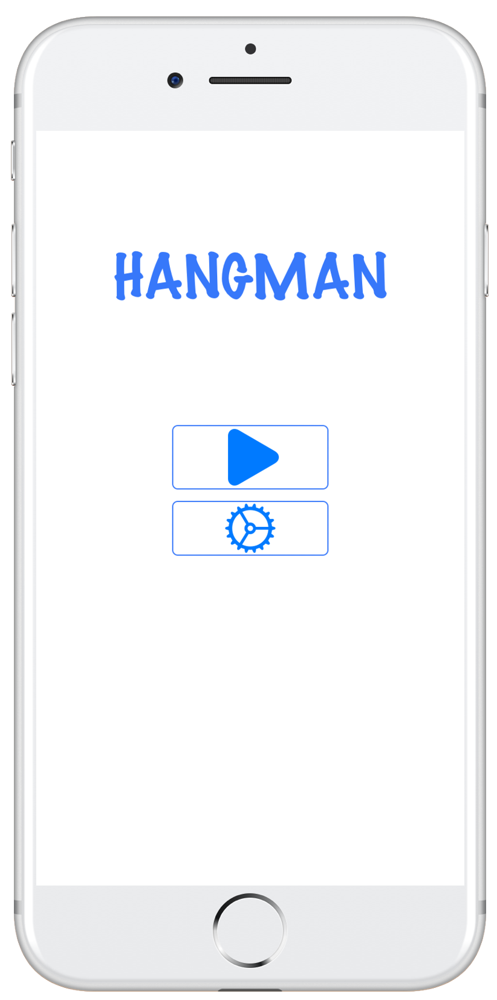
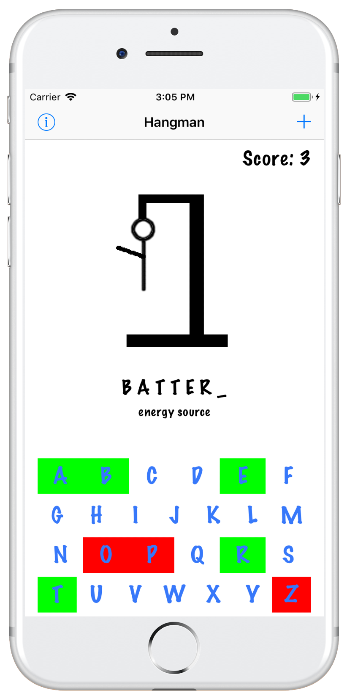
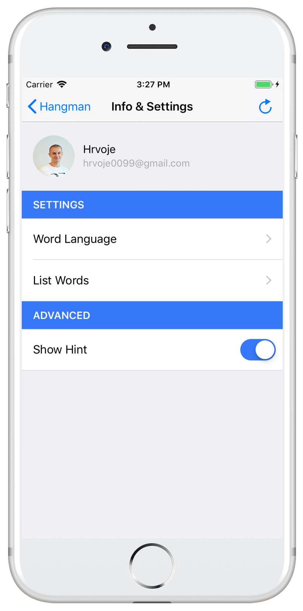
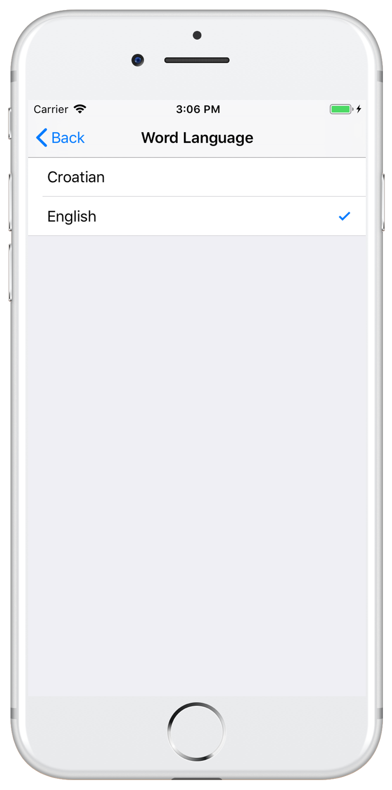
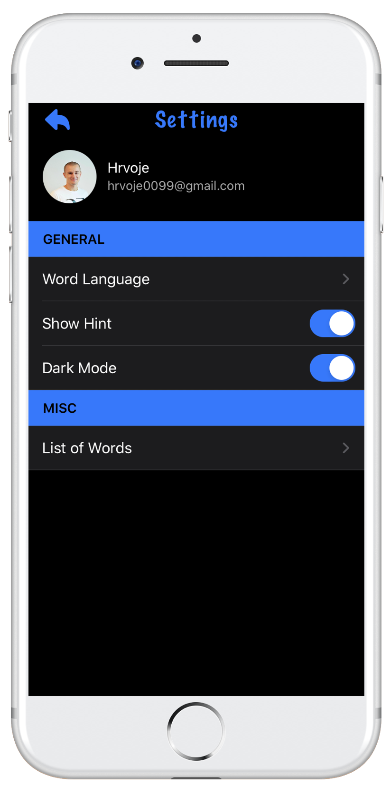

&nbsp;&nbsp;&nbsp;&nbsp;&nbsp;&nbsp;

# Hangman
Hangman is an iOS word-guessing game, which I recently built as a take-home project.

&nbsp;&nbsp;&nbsp;&nbsp;&nbsp;&nbsp;&nbsp;&nbsp;&nbsp;&nbsp;&nbsp;&nbsp;

&nbsp;&nbsp;&nbsp;&nbsp;&nbsp;&nbsp;&nbsp;&nbsp;&nbsp;&nbsp;&nbsp;&nbsp;

